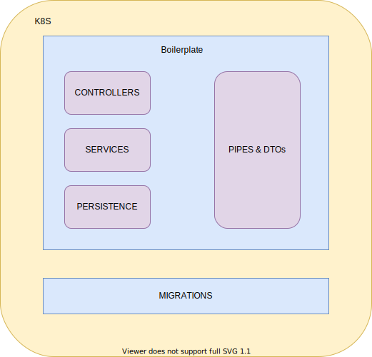

# NESTJS_BOILERPLATE API

## Arquitectura

Para este microservico de autenticación se ha utilizado un modelo de tres capas: controladores, servicios y persistencia.



Este modelo es el sugerido por NestJS.

### Estructura de carpetas:

El proyecto está estructurado de la siguiente manera:
- **app:** Contiene el código fuente de la aplicación y sus test unitarios y e2e, además de configuraciones generales de jest, sonarqube y typescript.
- **chart:** Contiene las plantillas de configuración para el despliegue en k8s.
- **docker:** Contiene el Dockerfile para la construcción de la aplicación.
- **docs:** Contiene documentación importante referente a la aplicación, como el modelo entidad-relación.
- **local:** Contiene archivos necesarios para la ejecución de la aplicación, archivos *.env*.
- **scripts:** Contiene scripts de bash utilizados en las tareas automáticas.

## Pre-requisitos

- Docker
- GNU Make
- Nest JS
- npm
- Tener en cuenta el nombre del proyecto que se quiera poner, y reemplazar en todos los archivos donde se encuentre "project-name" por el que se quiera.

## Getting started

1. ### Clonar el repositorio de Bitbucket:
   ```bash
   git clone git@bitbucket.org:tradesystem/nestjs_boilerplate.git
   ```

2. ### Como correr localmente

- Para contruir una imagen con el código actualizado se utiliza el siguiente comando (El project name será el nombre que se quiera asignar al proyecto):

  ```bash
  make docker-build-projec-name
  ```


- Para levantar una base de datos MySQL localmente se utiliza el siguiente comando:

  ```bash
  make local-run-db
  ```

- Para correr localmente un contenedor con la imagen creada se utiliza el siguiente comando:

  ```bash
  make local-run VERSION=latest
  ```

### Nota:

- Para detener los contenedores de aplicación y base de datos, se usa el siguiente comando:

  ```bash
    make local-stop
  ```

## Pruebas Unitarias y E2E

La carpeta test se encuentra en **/src**, y se dividen de acuerdo a su propósito:
- **e2e:** Contiene las pruebas E2E para los módulos que se tenga en el proyecto.
- **unit:** Contiene pruebas unitarias para dtos, servicios y controladores de los módulos que se tengan en el proyecto.
  
### ¿Cómo correr las pruebas?

- Para correr las pruebas unitarias utilizamos el siguiente comando:

  ```bash
  make run-unit-test VERSION=${VERSION}
  ```

  ej:

  ```bash
  make docker-build-project-name VERSION=latest
  ```

- Para correr las pruebas e2e se utiliza el siguiente comando:

  ```bash
  make run-e2e-tests VERSION=${VERSION}
  ```

  ej:

  ```bash
  make run-e2e-tests VERSION=latest
  ```

## Migraciones

Las migraciones de la base de datos se encuentran en el folder **src/migration**.

### Generación de migraciones:

Para generar un nuevo archivo de migración se debe utilizar el siguiente comando:

```bash
make create-migration VERSION=${VERSION} FILENAME=${FILENAME}
  ```

  ej:

  ```bash
  make create-migration VERSION=latestFILENAME=initial-migration
  ```
### Correr migraciones:

Para ejecutar las migraciones en un ambiente local se debe utilizar el siguiente comando:

```bash
  make run-migration VERSION=${VERSION}
  ```
ej:

```bash
  make run-migration VERSION=latest
  ```

## TECH STACK

 Nombre | Descripción | Useful Resources
--- | --- | ---
Nestjs | Framework para crear aplicaciones del lado del servidor Node.js escalables y eficientes. Utiliza JavaScript progresivo, totalmente compatible con TypeScript.| [Official site](https://docs.nestjs.com/) resources.
Pipes |Clase  de validación, evalua los datos de entrada.| [Official site](https://docs.nestjs.com/pipes) resources.
Typeorm | TypeORM es un ORM que se puede ejecutar en plataformas NodeJS y utilizar con TypeScript y JavaScript.| [Official site](https://typeorm.io/#/) resources. <br/> - [SQL (TypeORM)](https://docs.nestjs.com/recipes/sql-typeorm#sql-typeorm) NestJS resource. 
MySQL |MySQL es un sistema de base de datos relacional open-source.|[Official site](https://www.mysql.com/) resources.
Jest |Jest es un marco de pruebas de JavaScript que se centra en la simplicidad.| [Official site](https://jestjs.io/en/) resources.  <br/> - [Testing](https://docs.nestjs.com/fundamentals/testing#testing) NestJS resource. 
Supertest |Framework de pruebas que proporcionan una abstracción de alto nivel para probar HTTP, al mismo tiempo que le permiten acceder a la API de nivel inferior proporcionada por superagent.| [Official site](https://github.com/visionmedia/supertest) resources.
Swagger |Swagger es un framework para documentar APIs Rest desde diferentes fuentes.| [Official site](https://swagger.io/docs/specification/2-0/what-is-swagger/) resources. <br/> - [Swagger plugin](https://docs.nestjs.com/openapi/cli-plugin) NestJS resource.